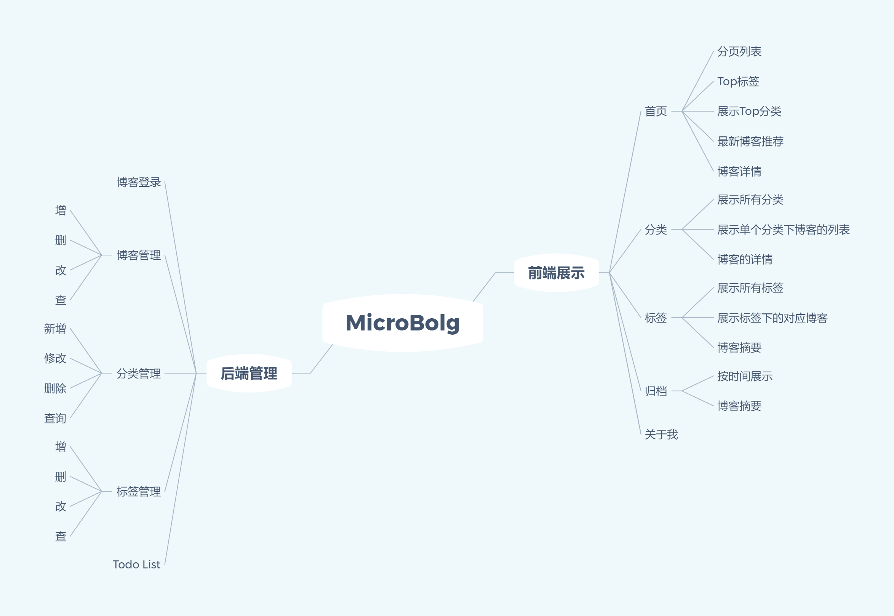

# MicroBlog

本项目是一个简洁的个人博客系统，供Spring Boost初学者学习使用。

## 关于

系统功能需求:

[预览视频](https://raw.githubusercontent.com/Gary-code/MicroBlog/master/%E9%A2%84%E8%A7%88%E8%A7%86%E9%A2%91.mp4)

使用技术栈:

* SpringBoot
* JDBC
* Semantic UI

## 运行项目

* 本地配置好MySQL环境。
* 目前并不支持注册功能。
* MySQL数据库名为`blog`。

## 如何登录?

本地数据库通过`MD5Utils class` 来设置密码

1. 输入你的密码，运行这个类当中的`main`函数。
2. 将返回的字符串作为MySQL数据库的密码字段。
